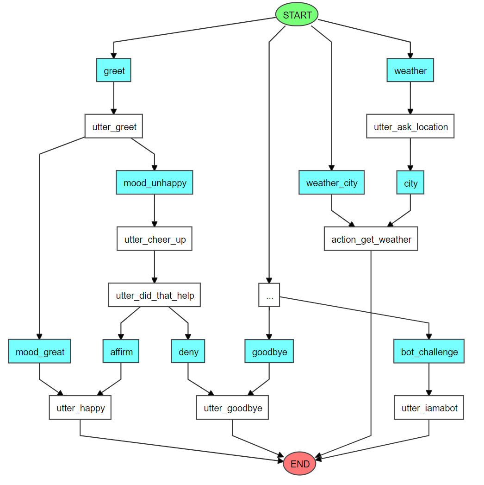

# rasa-weather-assistant

This is a demo weather assistant created with [Rasa](https://rasa.com/) framework.

This system uses the [OpenWeatherMap](https://openweathermap.org/) API to fetch real time weather data. You just need to sign up there and provide `actions/actions.py` with your personal API token.

## Installation

Install Rasa in a clean virtual environment using pip.

```
$ python3 -m venv ./venv
$ source ./venv/bin/activate
$ pip3 install -U pip
$ pip3 install rasa
```

## Usage

Train your model using:
```
$ rasa train
```

Start the API action server with which the model communicates:
```
$ rasa run actions
```

Talk with your bot throught command line with:
```
$ rasa shell
```


## Visualization

In the next graph all stories are visualized. The intents are shown in blue boxes and the bot's responses in white. The 2 stories on the left, starting with the `greet` intent are the default simple Rasa stories. Our weather assistant, the two created stories, is visualized in the right two pipelines.

This graph has been created with Rasa's internal command:
```
$ rasa visualize
```


